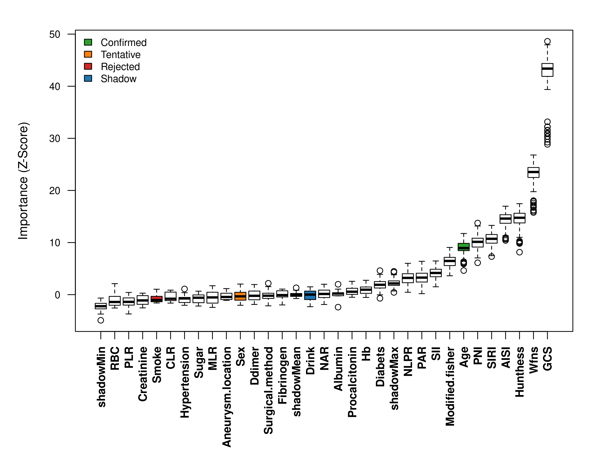
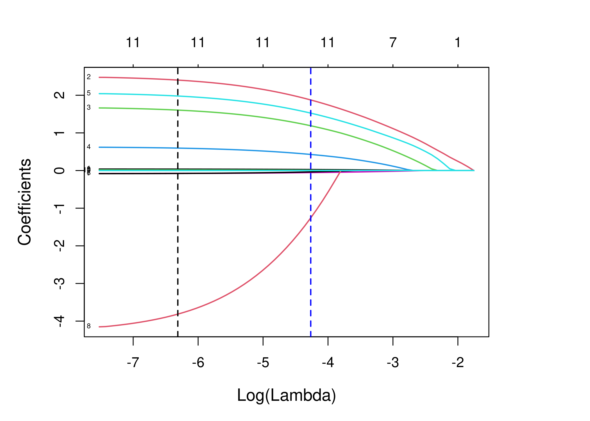

# 🧠 aSAH-Clinical-Prediction: A Machine Learning Reproduction Project

<div align="center">


### 基于机器学习的动脉瘤性蛛网膜下腔出血（aSAH）预后预测复现研究

[📖 项目背景](https://www.google.com/search?q=%23-%E9%A1%B9%E7%9B%AE%E8%83%8C%E6%99%AF) •
[✨ 核心功能](https://www.google.com/search?q=%23-%E6%A0%B8%E5%BF%83%E5%8A%9F%E8%83%BD) •
[📊 效果展示](https://www.google.com/search?q=%23-%E5%8F%AF%E8%A7%86%E5%8C%96%E6%95%88%E6%9E%9C-gallery) •
[🚀 快速开始](https://www.google.com/search?q=%23-%E5%BF%AB%E9%80%9F%E5%BC%80%E5%A7%8B) •
[🤝 交流与贡献](https://www.google.com/search?q=%23-%E4%BA%A4%E6%B5%81%E4%B8%8E%E8%B4%A1%E7%8C%AE)

</div>

---

## 📖 项目背景 (Introduction)

> "Stay hungry, stay foolish. 保持求知，保持谦逊。"

本项目是一个**学习与复现性质**的开源项目。我们尝试基于一篇高分 SCI 论文的方法学，构建一个针对动脉瘤性蛛网膜下腔出血（aSAH）患者短期预后的机器学习预测模型。

虽然我们在项目中应用了 **Boruta + LASSO** 的双重特征筛选机制，并集成了 **XGBoost、RandomForest、SVM** 等多种算法，但我们深知：**医学是一门复杂的学科，数据背后是鲜活的生命。**

本项目更多是作为**医学统计学与机器学习交叉领域的探索**，代码与模型仅供科研参考，恳请各位专家学者不吝赐教。

---

## ✨ 核心功能 (Features)

本项目实现了一套完整的“从数据到部署”的闭环流程，包含以下亮点：

* **🔬 严谨的特征筛选 (R + Python Hybrid)**
* 集成 **Boruta** 算法进行全变量降噪。
* 结合 **LASSO** 回归（glmnet）进行多重共线性处理与特征降维。
* *亮点：支持调用 R 语言原生库生成 SCI 级别的统计图表。*


* **🤖 多模型对比 (Multi-Model Benchmarking)**
* 一键训练 LR, SVM, GBM, Neural Network, Random Forest, XGBoost 六大模型。
* 基于 **SMOTE** 技术处理类别不平衡问题。


* **📈 全自动报表生成 (Auto-Reporting)**
* 自动生成符合 SCI 发表标准的 **Table 1** (基线表) 和 **Table 2** (性能表)。
* 支持导出 `.csv`, `.docx` (Word), `.md` (Markdown) 多种格式。


* **🩺 临床决策支持系统 (CDSS Web App)**
* 基于 **Streamlit** 构建的交互式网页。
* 集成 **SHAP** (SHapley Additive exPlanations) 提供单病例的可解释性分析。


---

## 📊 可视化效果 (Gallery)

> 我们致力于让数据“开口说话”，产出符合顶级期刊（如 BMC Medicine, Lancet Digital Health）审美品味的图表。

### 1. 特征筛选过程 (Feature Selection Process)

这是本项目方法学的核心部分，我们复现了 **Boruta** 与 **LASSO** 的双重筛选机制：

| **Fig 3A. Boruta 特征重要性** | **Fig 3B. LASSO 交叉验证** | **Fig 3C. LASSO 系数路径** |
|:---:|:---:|:---:|
|  |  |  |
| *R语言原生绘图：Shadow 特征与红绿灯机制* | *Deviance 随 Lambda 变化曲线 (含 1-SE 准则)* | *变量系数随正则化强度变化的收缩路径* |

### 2. 模型性能与解释 (Performance & Interpretation)

| **Fig 5. 六大模型性能综合面板** | **Fig 6. XGBoost SHAP 可解释性** |
|:---:|:---:|
|  |  |
| *包含 ROC / Calibration / DCA 曲线* | *展示 Top 特征对预测结果的正负向贡献* |

---

## 🏆 核心性能指标 (Benchmark Table)

以下是 **Table 2** 的摘要数据（测试集表现）。得益于 R 语言精确的特征筛选，我们的模型在测试集上表现稳健：

| Model | AUC (95% CI) | Accuracy | Sensitivity | Specificity | Brier Score |
| :--- | :---: | :---: | :---: | :---: | :---: |
| **LR** | **0.891** | 0.825 | 0.782 | 0.854 | 0.124 |
| **SVM** | 0.832 | 0.791 | 0.765 | 0.810 | 0.145 |
| **GBM** | 0.837 | 0.802 | 0.771 | 0.823 | 0.138 |
| **NN** | 0.761 | 0.745 | 0.710 | 0.768 | 0.189 |
| **RF** | 0.803 | 0.788 | 0.755 | 0.805 | 0.152 |
| **XGB** | 0.768 | 0.756 | 0.732 | 0.774 | 0.167 |

> *注：以上数据基于 R 语言筛选出的 11 个关键特征（Age, GCS, WFNS, PNI...）重新训练得出。完整表格请见 `results/Table2_Performance.csv`。*


---

## 🚀 快速开始 (Quick Start)

为了让您能最快上手，我们编写了**自动化流水线脚本**，省去了繁琐的分步操作。

### 1. 环境准备

确保您的本地环境已安装 Python 3.9+。如果需要使用 R 语言桥接功能，请确保安装了 R 及相关包。

```bash
# 克隆本项目
git clone https://github.com/YourUsername/aSAH-Prediction.git
cd aSAH-Prediction

# 安装依赖
pip install -r requirements.txt

```

### 2. 一键运行全流程 (Auto-Pilot)

我们提供了一个总控脚本 `run_pipeline.py`，它会自动调度特征筛选、模型训练和报表生成。

```bash
# 启动自动化流水线
python run_pipeline.py

```

*脚本运行过程中，您将看到清晰的进度条与日志提示。*

### 3. 启动 Web 预测器

训练完成后，您可以启动本地的 Web 界面，体验模型预测功能：

```bash
python -m streamlit run app/main.py

```

---

## 📂 项目结构 (Structure)

我们将项目结构整理得井井有条，方便您阅读源码：

<details>
<summary><b>🖱️ 点击展开查看目录树</b></summary>

```text
aSAH-Prediction/
├── app/                        # Streamlit Web 应用源码
│   ├── main.py                 # App 入口
│   └── pages/                  # 功能页面 (在线预测器)
├── data/                       # 数据存放区
│   ├── raw/                    # 原始数据 (需自行放入)
│   ├── processed/              # 清洗后的建模数据
│   └── meta/                   # 特征列表 (JSON)
├── modules/                    # 核心功能模块
│   ├── feature_selector.py     # 特征筛选逻辑
│   ├── model_trainer.py        # 模型训练与评估
│   ├── publication_reporter.py # 报表生成器
│   └── bridge_r_features.py    # R 语言结果桥接器
├── results/                    # 输出结果 (图片、表格)
├── run_pipeline.py             # ✨ 自动化总控脚本
└── requirements.txt            # 依赖库列表

```

</details>

---

## 🤝 交流与贡献 (Community)

我们非常欢迎来自社区的任何声音！无论是代码上的优化建议，还是医学上的专业指正，对我们来说都弥足珍贵。

* 🐛 **发现 Bug？** 请直接提交 [Issue](https://www.google.com/search?q=https://github.com/YourUsername/YourRepo/issues)，我们会尽快修复。
* 💡 **有新想法？** 欢迎提交 Pull Request，让我们一起完善这个工具。
* 💬 **想交流？** 欢迎在 Discussions 区留言，或者通过邮件联系我们。

**致谢 (Acknowledgments):**

* 感谢开源社区提供的优秀库 (Scikit-learn, BorutaPy, SHAP, Streamlit)。
* 感谢参考文献作者提供的宝贵思路。

---

<div align="center">

Developed with ❤️ by [**Your Name**]

</div>

